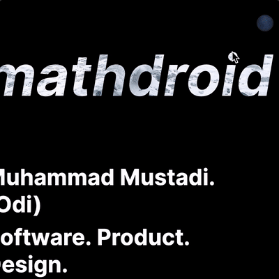

# `react-moon-toggle`

> Toggle dark mode (or anything) in moon phases emoji



## Usage

```js
import React from "react";
import Toggle from "react-moon-toggle";

const app = () => {
  const [dark, setDark] = React.useState(false);

  return <Toggle {...{ dark, setDark }} />;
};
```

## Installation

```sh
$ yarn add react-moon-toggle
```

## Props

```js
  dark, // boolean
  setDark = (newDark: boolean) => null, // ?function<boolean>
  interval = 50, // number
  darkIndex = INDEX.DARK, // number (0-7)
  lightIndex = INDEX.LIGHT, // number (0-7)
```

phases array used for indexes:

```js
const phases = ["🌑", "🌒", "🌓", "🌔", "🌕", "🌖", "🌗", "🌘"];
```

Any other props will be given directly to the `<button>` element.

## License

MIT
